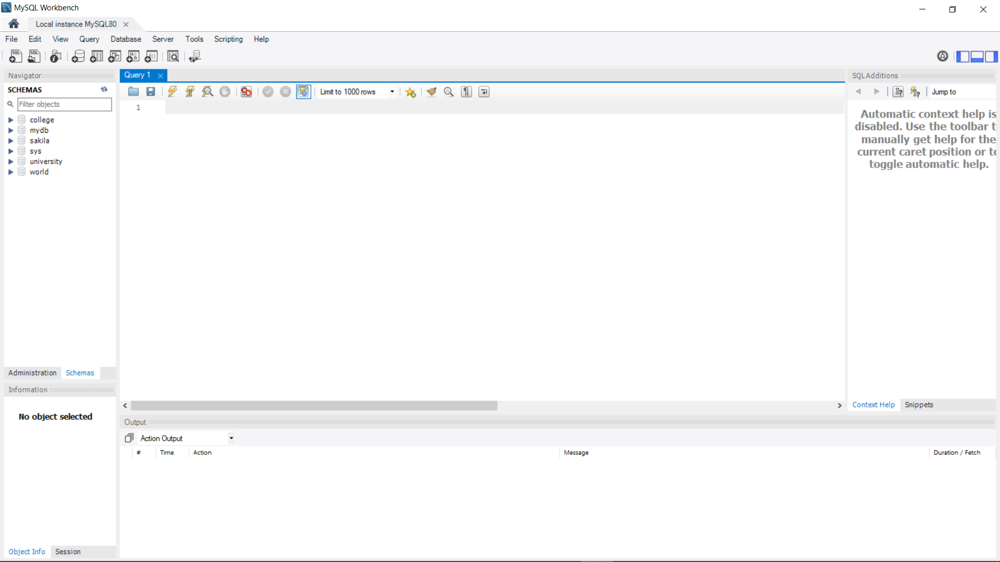
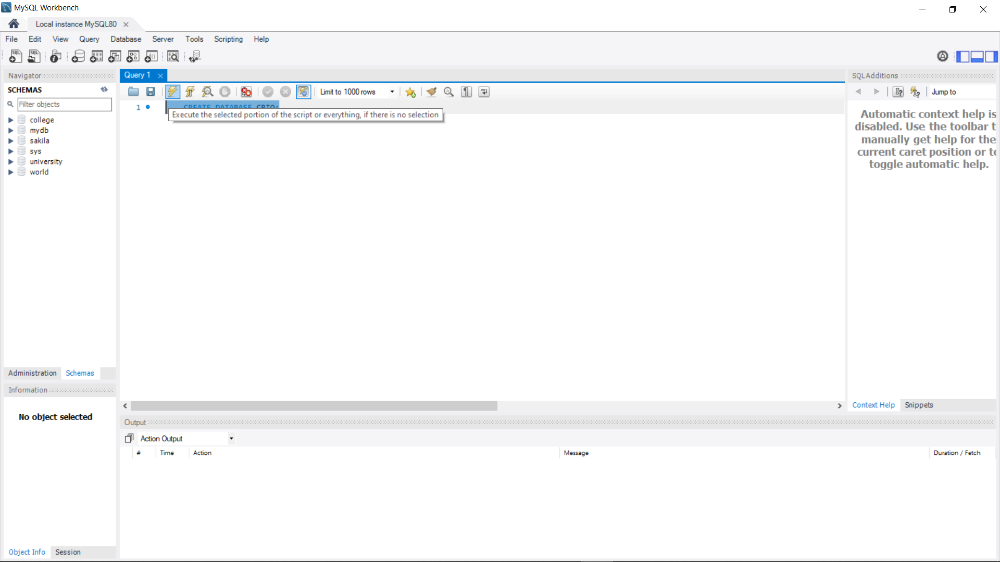
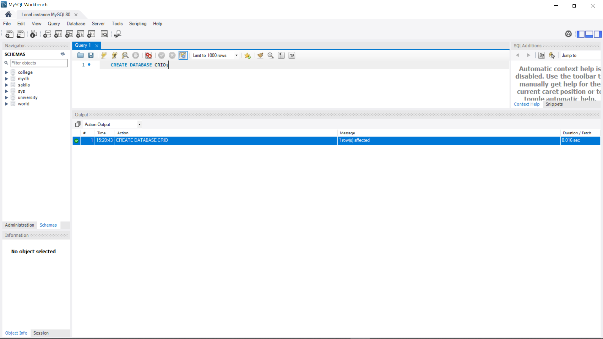
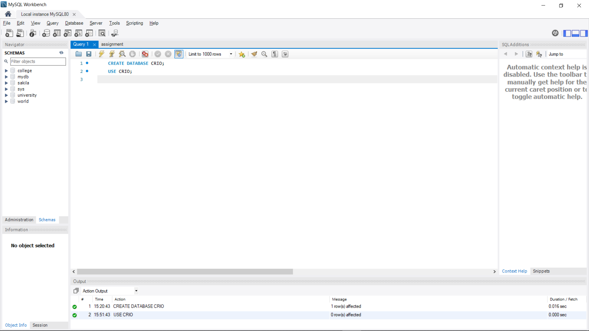
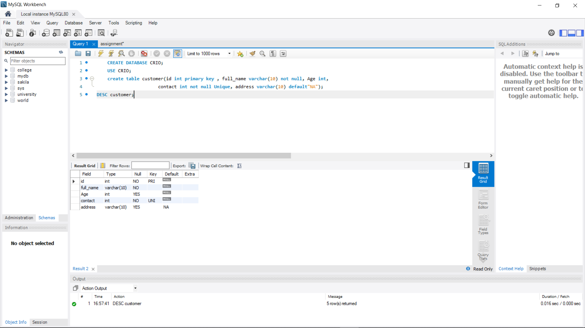
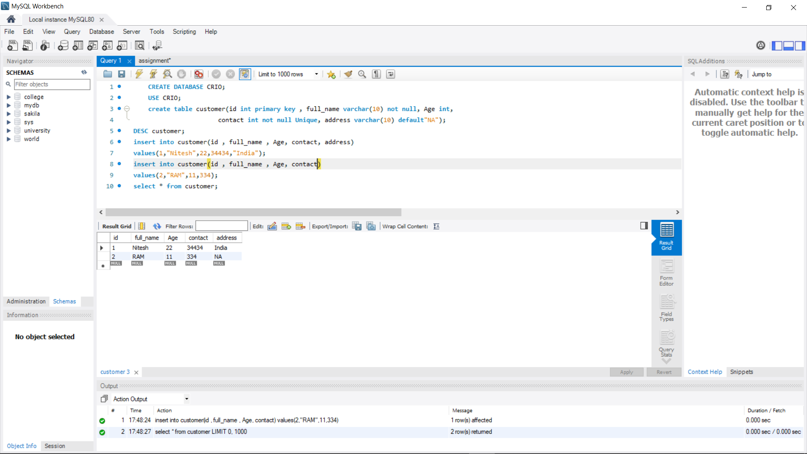

#Introduction

MySQL, the most popular Open Source SQL database management system, is developed, distributed, and supported by Oracle Corporation.
>A database is a structured collection of data. It may be anything from a simple shopping list to a picture gallery or the vast amounts of information in a corporate network
The SQL part of “MySQL” stands for “Structured Query Language”. SQL is the most common standardized language used to access databases
Table is a collection of data, organized in terms of rows and columns. In DBMS term, table is known as relation and row as tuple.

#Prerequisites

You'll need a SQL editor installed in your system for this activity. **No prior background knowledge** of SQL is required, just follow the Activities you will understand everything.

## Activities

### Activity 1: Choose a SQL editor

**You'll first need a SQl editor to before you begin this module. There are a lot of options to choose from including:**

1. `MySQL Workbench`
2. `Beekeeper Studio`
3. `HeidiSQL`
4. `SQuirreL SQL`
5. `Oracle SQL Developer`

And many more editors, you can check editors list from[here](https://www.geckoandfly.com/34197/free-sql-editor/). All these editors are free and user friendly.I'll be using `MySQL Workbench` for this module.

### Activity 2: Open MySQL Workbench 

By default you will be seeing a blank window,something like the image below 👇 

  

### Activity 3: Create a Database 

The next step is to create a Database in the MySQL Workbench,to create a Database use the "Query".
Here word Query came, so you might be thinking what is Query?
>So,a query is really a question or request for data.

Use the following query to create Database:
` CREATE DATABASE CRIO;`
Here CRIO is a name of database, you can give any name and every query should end with semicolon(;)
After writing the query just select the query and then click on execution button just like in image bellow 👇



After execution of query you will be seeing row(s) affected in output window, something like this 👇 



Congratulations!!🎉 you have successfully executed your first Query in SQL, so thats how we will be writing and executing Queries in MySQL.

### Activity 4: Use Database
Now in this step we will use the Database that we just created.
To use the Database use the following Query:
`USE CRIO;`
Here CRIO is a Database name.



### Activity 5: Create a Table with constraints

**So let us first understand what is constraints?**
-MySQL CONSTRAINT is used to define rules to allow or restrict what values can be stored in columns. The purpose of inducing constraints is to enforce the integrity of a database.
-MySQL CONSTRAINTS are used to limit the type of data that can be inserted into a table.

[Reference](https://www.w3resource.com/mysql/creating-table-advance/constraint.php#:~:text=MySQL%20CONSTRAINT%20is%20used%20to,be%20inserted%20into%20a%20table.) 

Now we will create a table using a Query:
```
create table customer(id int primary key , full_name varchar(10) not null, Age int,
contact int not null Unique,address varchar(10) default"NA");
```					   
Here table name is customer,**you can give any name as a table name** and we have created a field named id, full_name, Age, contact and address. **You can create your own field.** 
**Here you can see in a query above we have used constraints:
- primary key
- not null
- Unique 

Let us discuss what are these constraints and what they do.

Primary Key - A PRIMARY KEY constraint for a table enforces the table to accept unique data for a specific column and this constraint creates a unique index for accessing the table faster.

Not Null - 	In MySQL NOT NULL constraint allows to specify that a column can not contain any NULL value. MySQL NOT NULL can be used to CREATE and ALTER a table.

Unique - The UNIQUE constraint in MySQL does not allow to insert a duplicate value in a column. The UNIQUE constraint maintains the uniqueness of a column in a table. More than one UNIQUE column can be used in a table.

Default - In a MySQL table, each column must contain a value ( including a NULL). While inserting data into a table, if no value is supplied to a column, then the column gets the value set as DEFAULT.

Now execute the query.

### Activity 6: Describe the Table

After executing the create table query we need to check how our table looks for that we need to use the keyword DESC which means Describe, it will show us the table that we created.

Use following query:
`DESC byte;
Here byte is a table name.
After executing this query table will look like this 👇



Congratulations!!🎉 Our Table is created Successfully and now you can see table with the constraints. 

### Activity 7: Insert values into the Table

Now we will insert values into the Table.
To insert values into the Table we will use INSERT Query, it will insert values**NOTE**sql is not case sesitive language.
Now write the following code:
```
insert into customer(id , full_name , Age, contact, address)
values(1,"Nitesh",22,34434,"India");
insert into customer(id , full_name , Age, contact)
values(2,"RAM",11,334);
select * from customer;
```
You can give any value in the table.
**Notice** here that when we have inserted values second time, we have not given field address so when we will execute this query by default value will be printed in the table i.e NA, which we have while creating a table.

Here one for thing you can see in above query is line `select * from customer`.The SELECT statement is used to select data from a database and `*` is use to select all.
In short if we want to see the value that we have inserted into the table then we have to use this statement.

The final output will be like image below 👇  
 
 
 Congratulations🎉 we have successfully created a Table with constraints.
 
 ## SUMMARY
 We have created a Table, Inserted values in Table, Used Constraints in Table. Now you can easily create Table using SQL queries.
 
 ## REFERENCES

1. [w3resource](https://www.w3resource.com/index.php)
2. [w3schools.com](https://www.w3schools.com/default.asp)
3. [MySQLTUTORiAL](https://www.mysqltutorial.org/what-is-mysql/)
